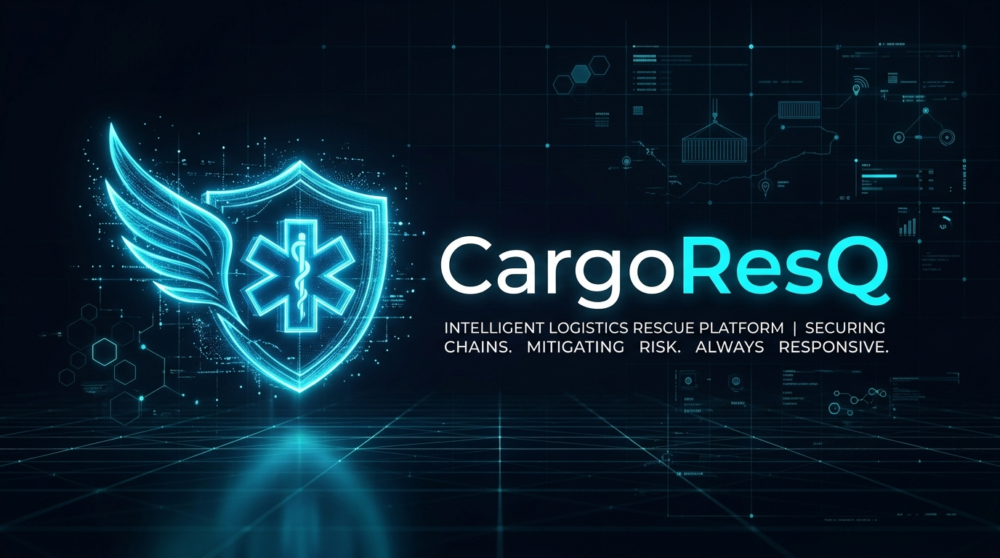
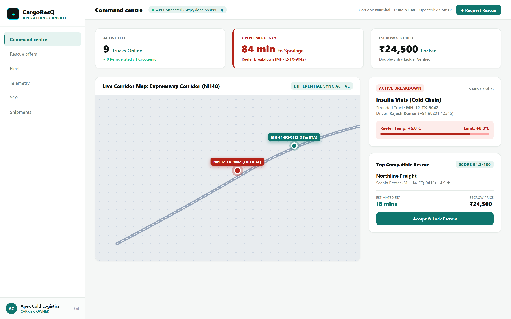
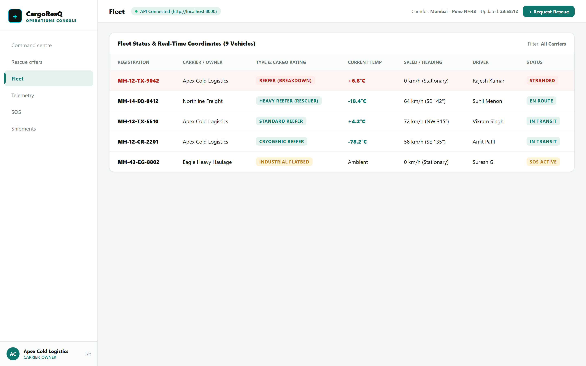
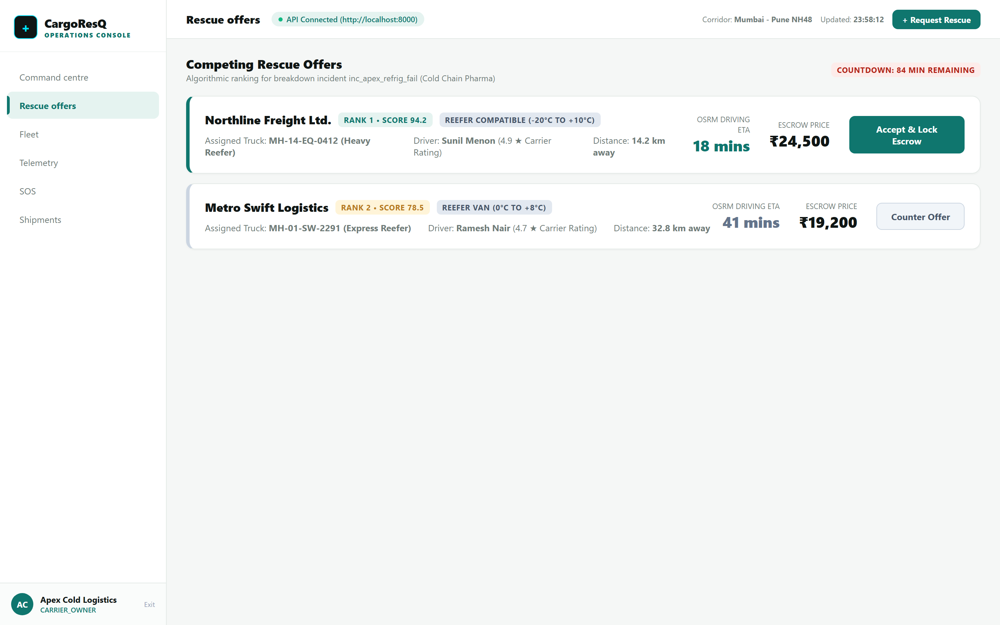
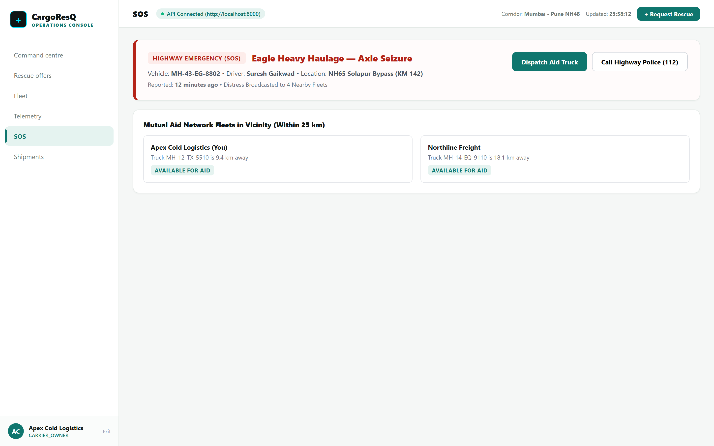
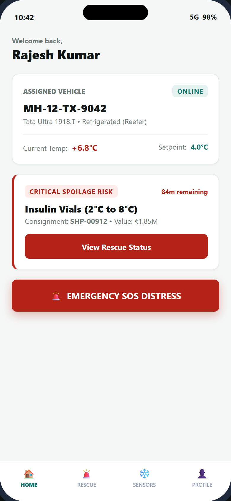
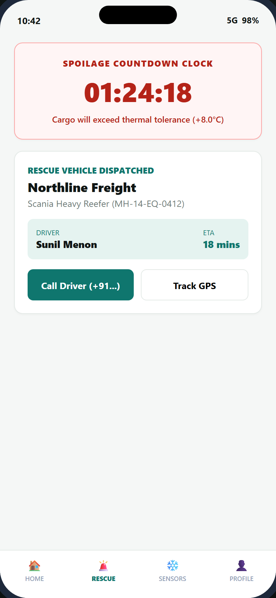

# CargoResQ — Autonomous In-Transit Cold-Chain Rescue & Escrow Settlement Platform

<p align="center">
  
</p>

<p align="center">
  <a href="https://github.com/neuralsin/CargoResQ/actions"></a>
  <a href="https://github.com/neuralsin/CargoResQ"></a>
  <a href="https://fastapi.tiangolo.com"></a>
  <a href="https://developer.android.com/kotlin"></a>
  <a href="https://customtkinter.tomschimansky.com"></a>
  <a href="https://github.com/neuralsin/CargoResQ/blob/main/LICENSE"></a>
</p>

---

## 📌 GitHub Repository & Quick Links

- **Main Repository**: [https://github.com/neuralsin/CargoResQ](https://github.com/neuralsin/CargoResQ)
- **Pull Requests**: [https://github.com/neuralsin/CargoResQ/pulls](https://github.com/neuralsin/CargoResQ/pulls)
- **CI / GitHub Actions**: [https://github.com/neuralsin/CargoResQ/actions](https://github.com/neuralsin/CargoResQ/actions)
- **Architecture Specification**: [docs/ARCHITECTURE.md](docs/ARCHITECTURE.md)
- **REST & WebSocket API Reference**: [docs/API_REFERENCE.md](docs/API_REFERENCE.md)
- **Developer Onboarding Guide**: [docs/DEVELOPER_GUIDE.md](docs/DEVELOPER_GUIDE.md)
- **Production Deployment Runbook**: [DEPLOYMENT.md](DEPLOYMENT.md)

---

## 🚛 The Problem: The Highway Cold-Chain Crisis

In India's cross-country logistics corridors (e.g., **NH48 Mumbai–Delhi**, **NH44 Srinagar–Kanyakumari**), hundreds of refrigerated trucks carry temperature-sensitive cargo every day:
- **Biopharmaceuticals & Vaccines** (strictly 2°C to 8°C)
- **Frozen Seafood & Dairy** (strictly -18°C to -20°C)
- **Fresh Agri-Produce & Chemicals**

When a reefer truck suffers an engine failure or compressor breakdown in mid-transit, a catastrophic countdown begins: the **Spoilage Deadline**. Within 2 to 4 hours, cabin temperatures rise, resulting in complete cargo loss (often valued in tens of lakhs of rupees).

### Why Traditional Systems Fail:
1. **Zero Coordinated Peer Discovery**: Stranded drivers make desperate, uncoordinated phone calls to local towing agents who lack refrigerated trailers.
2. **Untrusted Inter-Carrier Handoffs**: Competitor carriers operate in silos; without guaranteed financial settlement or escrow, nearby trucks with empty reefer capacity will not stop to assist.
3. **Unverified Delivery Disputes**: Insurance providers and consignees frequently litigate spoiled goods because there is no cryptographically attested continuous temperature audit trail.

---

## 💡 The Solution: CargoResQ

**CargoResQ** creates an autonomous, peer-to-peer mutual aid and emergency rescue network for commercial transport carriers. 

```
                                 THE CARGORESQ LIFECYCLE
                                 
   [ Stranded Reefer ]              [ CargoResQ Engine ]             [ Rescuing Carrier ]
            |                                |                                 |
     1. Breakdown / SOS -------------------->|                                 |
        (Transponder Alarm)                  |                                 |
                                             |-- 2. Dijkstra Match ----------> |
                                             |      (Route, ETA, Reefer Fit)   |
                                             |                                 |
                                    3. Two-Way Handshake                       |
                                    (Owner & Helper Bind)                      |
                                             |                                 |
                                    4. Escrow Locked                           |
                                    (Double-Entry Hold)                        |
                                             |                                 |
                                             |<-- 5. Rescue In-Transit --------|
                                             |       (Continuous Telemetry)    |
                                             |                                 |
                                    6. Attested Delivery                       |
                                    (IoT Temperature Check)                    |
                                             |                                 |
                                    7. Automatic Settlement                    |
                                    (Instant Payout Release)                   |
```

---

## 🏛️ System Architecture

CargoResQ uses a clean hexagonal architecture mounted as a unified, high-performance ASGI service:

```
+-----------------------------------------------------------------------------------+
|                                  CLIENT INTERFACES                                |
|                                                                                   |
|     +-----------------------------------+    +----------------------------------+ |
|     |    Desktop Operations Console     |    |    Android Driver Companion      | |
|     |    (CustomTkinter / OSM Live Tile)|    |    (Native Kotlin / osmdroid)    | |
|     +-----------------+-----------------+    +----------------+-----------------+ |
+-----------------------|---------------------------------------|-------------------+
                        |                                       |
                        | HTTP REST / Authenticated WebSockets  |
                        v                                       v
+-----------------------------------------------------------------------------------+
|                                FASTAPI CORE GATEWAY                               |
|                                                                                   |
|  * JWT Tenant Authentication (shared.rbac)     * SlowAPI Rate Limiting            |
|  * Tenant-Isolated WebSocket Rooms             * Structured Observability         |
+-----------------------------------------------------------------------------------+
       |                   |                   |                   |
       v                   v                   v                   v
+--------------+    +--------------+    +--------------+    +--------------+
|  TELEMETRY   |    |  MATCHING &  |    | ORCHESTRATOR |    |    ESCROW    |
|    & SOS     |    |   ROUTING    |    |  & HANDSHAKE |    |    LEDGER    |
+--------------+    +--------------+    +--------------+    +--------------+
| Ingest pings |    | Dijkstra     |    | Two-Way      |    | Double-entry |
| Jitter/Mock  |    | pathfinding  |    | handshake    |    | accounting   |
| filter       |    | Spoilage     |    | Atomic bind  |    | IoT coldchain|
| Duress PIN   |    | classification    | DB partial   |    | attestation  |
| Broadcast    |    | Dynamic fare |    | unique index |    | Auto dispute |
+--------------+    +--------------+    +--------------+    +--------------+
       |                   |                   |                   |
       +-------------------+---------+---------+-------------------+
                                     |
                                     v
+-----------------------------------------------------------------------------------+
|                            DATABASE & PERSISTENCE LAYER                           |
|                                                                                   |
|   * PostgreSQL 16 + PostGIS (Production) / SQLite + aiosqlite (Local Dev)         |
|   * Zero-Drift Alembic Versioned Migrations                                       |
+-----------------------------------------------------------------------------------+
```

---

## ✨ Core Pillars & Capabilities

### 1. Real-Time Telemetry & Transponder Ingest
- **Micro-Batch Ingest**: Ingests GPS, vehicle speed, heading, and cargo temperature readings (`/api/v1/telemetry/pings`).
- **Anti-Spoofing & Jitter Rejection**: Detects and flags mock locations, teleports, and anomalous speed readings.
- **Unplanned Dwell Detection**: Flags trucks stopped on highway shoulders for over 15 minutes.
- **Silent Duress Emergency PIN**: Allows drivers under coercion to enter emergency PIN `9999`, which renders a mock "cancelled" UI to attackers while instantly alerting state police and fleet dispatch.

### 2. Spoilage-Aware Dijkstra Routing & Matching
- **Multi-Factor Candidate Scoring**: Computes distance, remaining reefer volume/weight capacity, carrier historical reputation score, and cold-chain compliance.
- **Dynamic Spoilage Classifier**: Calculates real-time thermal runaway curves based on ambient weather and cargo insulation parameters.
- **Porter-Style Fare Estimator**: Dynamic pricing engine balancing base rate, urgency premium, scarcity index, and carrier payout protection floors.

### 3. Race-Free Two-Way Offer Handshake
- **Mutual Consensus Binding**: Both stranded owner and assisting rescuer must accept the dispatch terms.
- **Concurrency Protection**: Protected by database partial unique index (`active_bound_rescue_per_incident_idx`). Sibling competitor offers are atomically superseded the instant an agreement binds.

### 4. Double-Entry Escrow & Automated IoT Settlement
- **Auditable Ledger**: Credits and debits are immutably posted (`services/escrow_ledger`).
- **Verifiable Settlement**: At drop-off, the engine audits the entire temperature timeseries:
  - If **temperatures stayed compliant** $\rightarrow$ Funds are instantly credited to the helper carrier.
  - If **cold-chain was breached** $\rightarrow$ Escrow automatically shifts to `DISPUTED`, freezing funds for arbitration.

---

## 🖥️ Client Applications

### A. Desktop Operations Console (`desktop_app/`)
- Built with **Python 3.11** & **CustomTkinter** for a sleek, dark-themed operations experience.
- **OpenStreetMap Live Map Feed**: Real-time rendering of all trucks, active breakdown beacons, and animated rescue vectors.
- **Command Centre**: Tabbed panels for Fleet Overview, Live Telemetry, Rescue Offers, SOS Alerts, and Escrow Balances.
- **Porter Fare Estimator Modal**: Interactive route distance and cargo pricing calculator.

### B. Native Android Driver App (`android_app/`)
- Built with **100% Native Kotlin**, Material Design 3, Retrofit, and `osmdroid`.
- **Persistent Background Telemetry**: `TelemetryService` foreground worker transmits continuous GPS and cargo temp fixes even when the screen is locked.
- **1-Tap Emergency Transponder**: Immediate emergency SOS trigger with breakdown categorization.
- **Emergency Dialing System**: Instant calling shortcuts to national emergency services (**112 Police/Ambulance**, **108 Medical**, **1033 National Highway Helpline**).

---

## 📸 Screenshots Showcase

| Desktop Operations Console | Live Radar & Fleet Tracking |
|:---:|:---:|
|  |  |

| Rescue Offers & Two-Way Handshake | Emergency Transponder & SOS |
|:---:|:---:|
|  |  |

| Android Driver Companion | Breakdown SOS & Emergency Mode |
|:---:|:---:|
|  |  |

---

## 🚀 Quickstart Guide

### Option 1: One-Click Master Launcher (Windows)
```cmd
export\run_all.bat
```
*This automatically initializes the database, seeds rich multi-carrier demo data, launches the backend on port 8000, and opens the desktop console.*

---

### Option 2: Step-by-Step Manual Setup

#### 1. Clone the repository
```bash
git clone https://github.com/neuralsin/CargoResQ.git
cd CargoResQ
```

#### 2. Create and activate a virtual environment
```bash
python -m venv .venv

# Windows (PowerShell):
.venv\Scripts\Activate.ps1

# Linux / macOS:
source .venv/bin/activate
```

#### 3. Install dependencies
```bash
python -m pip install --upgrade pip
pip install -r requirements.txt
pip install -r desktop_app/requirements.txt
```

#### 4. Seed demo dataset
Populates 4 transport companies, 9 trucks, 5 live shipments, telemetry streams, and active rescue offers:
```bash
python scripts/seed_demo.py
```
*(Credentials will be printed to stdout and saved to `demo_credentials.json`)*.

#### 5. Launch the backend server
```bash
python main.py
```
- API Base: `http://localhost:8000`
- Interactive Swagger Docs: `http://localhost:8000/docs`
- Real-time WebSocket: `ws://localhost:8000/ws`

#### 6. Launch the desktop operations console
In a new terminal:
```bash
python -m desktop_app.app
```

#### 7. Android Driver App
- Sideload precompiled APK:
  ```bash
  adb install export/CargoResQ-Driver.apk
  ```
- Or build from source using Gradle:
  ```bash
  cd android_app
  ./gradlew assembleDebug
  ```
- To tunnel your physical Android phone to your local PC backend over USB:
  ```cmd
  connect_phone_usb.bat
  ```

---

## 🧪 Comprehensive Test Suite

CargoResQ has 100% automated test coverage across all critical security, matching, escrow, and lifecycle flows:

```bash
python -m pytest -v
```

### Verified Test Categories (105 / 105 Passing):
- `tests/test_rescue_lifecycle.py`: Complete end-to-end breakdown, Dijkstra match, offer binding, and escrow release lifecycle.
- `tests/test_offer_handshake.py`: Race conditions, mutual consent, sibling offer auto-cancellation.
- `tests/test_security_boundaries.py`: Tenant room isolation, token forging defenses, unauthenticated route rejection.
- `tests/test_escrow_ledger.py`: Double-entry zero-sum balancing, verifiable cold-chain temperature thresholds.
- `tests/test_sos_and_telemetry.py`: GPS jitter filtering, dwell detection, silent duress PIN codes.
- `tests/test_websocket.py`: Connection lifecycle, token handshake timeout, tenant-scoped event filtering.
- `services/pricing_engine/tests/test_pricing.py`: Distance, cargo class, urgency curves, and carrier floor rate protections.

---

## 📂 Project Structure

```
CargoResQ/
│
├── .github/workflows/ci.yml       # Automated GitHub Actions CI pipeline
├── main.py                        # Unified FastAPI gateway & ASGI application
├── requirements.txt               # Backend & testing dependencies (pydantic[email], etc.)
├── cargoresq.db                   # Local SQLite database
├── connect_phone_usb.bat          # ADB reverse USB tunnel for physical Android phone
├── demo_credentials.json         # Seeded demo credentials
│
├── docs/                          # Comprehensive technical documentation
│   ├── ARCHITECTURE.md            # System architecture, topology, and state machines
│   ├── API_REFERENCE.md           # REST endpoints and WebSocket protocol specification
│   └── DEVELOPER_GUIDE.md         # Developer onboarding, testing, and compilation
│
├── services/                      # Domain services (hexagonal modules)
│   ├── core_api/                  # Auth, drivers, trucks, shipments, breakdowns
│   ├── matching_engine/           # Dijkstra routing, spoilage margins, candidate scoring
│   ├── orchestrator/              # Incident state machine, 2-way handshake, reputation
│   ├── escrow_ledger/             # Double-entry ledger, temperature attestation
│   ├── pricing_engine/            # Porter-style dynamic pricing & urgency models
│   ├── realtime_gateway/          # Authenticated WebSocket hub & tenant projections
│   ├── sos/                       # Emergency transponder, responder ranking, duress PIN
│   └── telemetry/                 # Ping ingest, anti-spoofing, dwell alerts, workers
│
├── desktop_app/                   # CustomTkinter Desktop Operations Console
│   ├── app.py                     # Main GUI application & command centre
│   ├── map_panel.py               # OpenStreetMap interactive live vector map
│   ├── api_client.py              # Async HTTP & WebSocket client
│   └── build_windows.ps1          # PyInstaller standalone EXE compiler
│
├── android_app/                   # Native Kotlin Android Driver Companion App
│   ├── app/src/main/              # Kotlin sources, osmdroid maps, Material 3 layouts
│   └── build.gradle               # Gradle build configuration
│
├── export/                        # Production deliverables & brand assets
│   ├── CargoResQ-Driver.apk       # Ready-to-install Android driver APK
│   ├── run_all.bat                # Master one-click platform runner
│   ├── brand_hero.png             # High-resolution corporate brand visual
│   └── logo.png                   # Brand identity logo
│
├── scripts/                       # Automation and seeding utilities
│   └── seed_demo.py               # Enriched 4-carrier demo data generator
│
└── tests/                         # Comprehensive pytest test suite (105 tests)
```

---

## 🔒 Security & Privacy Notice

- All driver locations and private cargo commercial details are strictly partitioned.
- Network broadcast alerts redact carrier commercial terms and cargo owners until an offer is legally `BOUND`.
- Duress cancellation features are designed in compliance with driver safety best practices.

---

## 📄 License & Attribution

CargoResQ is open-sourced under the [Apache 2.0 License](LICENSE).  
Developed with passion by **Shaan** ([@neuralsin](https://github.com/neuralsin)).  
For contributions, bug reports, or enterprise logistics integrations, please visit [https://github.com/neuralsin/CargoResQ/issues](https://github.com/neuralsin/CargoResQ/issues).
