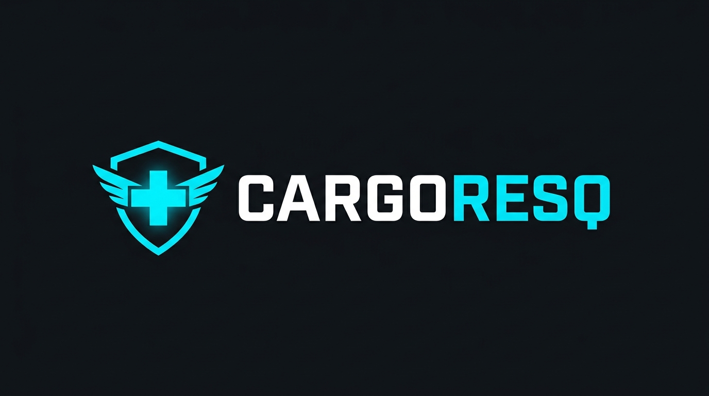

# CargoResQ — Production Export Package
### Cross-Carrier In-Transit Rescue & Escrow Settlement Platform

<p align="center">
  
</p>

---

## 📦 What's in this Export Folder

This package contains everything needed to showcase, test, and demonstrate **CargoResQ** across all platforms and operating modes:

```
export/
│
├── logo.png                # High-definition brand logo banner (PNG)
├── logo.jpg                # Alternative high-res logo format
├── icon.png                # Premium 1:1 squircle app icon / mobile launcher icon
├── icon.jpg                # Alternative 1:1 icon format
├── brand_hero.png          # High-tech corporate hero visual banner (PNG)
├── brand_hero.jpg          # Alternative high-res hero format
├── logo.svg                # Scalable vector graphics logo
│
├── CargoResQ-Driver.apk    # Native Android driver app (Android 8.0 - 14+)
│
├── run_all.bat             # One-click master launcher (seeds DB, boots server, opens desktop console)
├── 1_start_backend.bat     # Launches the FastAPI Core API & Orchestrator on port 8000
├── 1_start_backend.ps1     # PowerShell version of backend launcher
├── 2_seed_demo_data.bat    # Seeds 4 carriers, 9 trucks, 5 shipments, cold-chain telemetry, & offers
├── 2_seed_demo_data.ps1    # PowerShell version of demo data seeder
├── 3_start_desktop_console.bat # Launches CustomTkinter Desktop Operations Console
├── 3_start_desktop_console.ps1 # PowerShell version of desktop console launcher
├── 4_run_simulation_mode.bat   # Runs automated breakdown & rescue scenarios
├── 4_run_simulation_mode.ps1   # PowerShell version of simulation runner
├── 5_install_driver_apk.bat    # ADB sideload script to install APK to phone/emulator
├── 5_install_driver_apk.ps1    # PowerShell version of ADB APK installer
│
├── run_simulation.py       # Python CLI simulation engine client
└── README.md               # Complete platform manual & guide (this file)
```

---

## 🚀 Quickstart: Running in 60 Seconds

### Option A: One-Click Master Launcher
Double-click:
```cmd
run_all.bat
```
This automatically:
1. Resets and seeds the enriched multi-carrier database.
2. Spawns the FastAPI backend server on `http://localhost:8000`.
3. Opens the CustomTkinter Operations Console.

---

### Option B: Running Step-by-Step

#### Step 1: Start the Backend Server
Double-click `1_start_backend.bat` or run:
```powershell
python main.py
```
> The API will be live on `http://localhost:8000` (Swagger docs available at `http://localhost:8000/docs`).

#### Step 2: Seed the Enterprise Demo Dataset
Double-click `2_seed_demo_data.bat` or run:
```powershell
python scripts/seed_demo.py --reset --password Password123!
```

#### Step 3: Launch the Operations Console
Double-click `3_start_desktop_console.bat` or run:
```powershell
python desktop_app/app.py
```

#### Step 4: Run Automated Simulation Scenarios
Double-click `4_run_simulation_mode.bat` or run:
```powershell
python export/run_simulation.py --scenario cold_chain_critical
```
Available simulation scenarios:
- `cold_chain_critical`: Temperature excursion on insulin with 40-minute spoilage clock.
- `competing_rescuers`: Multiple nearby carriers competing on ETA and Rescue Score.
- `hazmat_no_match`: Incompatible cargo rejection test.

---

## 📱 Native Android Driver App

### Sideloading the APK onto a Phone or Emulator
1. Connect your Android device via USB with **USB Debugging** enabled (or start an Android Studio emulator).
2. Double-click `5_install_driver_apk.bat` or run:
   ```cmd
   adb install -r export/CargoResQ-Driver.apk
   ```
3. Alternatively, copy `export/CargoResQ-Driver.apk` directly to your phone storage or Google Drive and open the file to install.

### Connecting the Driver App to your Backend
When the app launches:
- **Server Address**:
  - If running on an Android Emulator: `http://10.0.2.2:8000`
  - If running on a physical Android phone connected to the same Wi-Fi: `http://<YOUR_PC_LOCAL_IP>:8000` (e.g. `http://192.168.1.15:8000`)
- **Email**: `rajesh@apexcold.example` (or any driver below)
- **Password**: `Password123!`

---

## 🔑 Enterprise Demo Accounts & Credentials

All demo accounts share the password: **`Password123!`**

### 🏢 Operations Console (Desktop)

| Company | Role | Email | Password |
|---|---|---|---|
| **Apex Cold Logistics** | Stranded Cargo Owner | `ops@apexcold.example` | `Password123!` |
| **Northline Freight** | Rescuer Fleet (Competitor) | `ops@northline.example` | `Password123!` |
| **Metro Swift Logistics** | Urban Rapid Carrier | `ops@metroswift.example` | `Password123!` |
| **Eagle Heavy Haulage** | Industrial / Hazmat Carrier | `ops@eaglehaul.example` | `Password123!` |

### 🚚 Driver App (Mobile APK)

| Driver Name | Company | Assigned Truck | Email | Password |
|---|---|---|---|---|
| **Rajesh Kumar** | Apex Cold | `MH-12-TX-9042` (Reefer, Stranded) | `rajesh@apexcold.example` | `Password123!` |
| **Vikram Singh** | Apex Cold | `MH-12-TX-5510` (Reefer, In-transit) | `vikram@apexcold.example` | `Password123!` |
| **Amit Patil** | Apex Cold | `MH-12-CR-2201` (Cryo Reefer) | `amit@apexcold.example` | `Password123!` |
| **Sunil Menon** | Northline | `MH-14-EQ-0412` (Scania Reefer, Rescuer) | `sunil@northline.example` | `Password123!` |
| **Deepak Shinde** | Northline | `MH-14-EQ-9110` (Heavy Reefer) | `deepak@northline.example` | `Password123!` |

---

## 🌟 Key Features Demonstrated

1. **Cross-Carrier Matching Engine**:
   - Matches stranded cargo only to physically compatible trucks (temperature rating, payload volume, hazmat certification).
   - Dynamic Rescue Score based on OSRM driving ETA, distance, and counterparty reputation.
2. **Two-Way Cryptographic Handshake**:
   - Rescues bind only when **both** sides commit (carrier accepts payout, owner confirms terms).
3. **Double-Entry Escrow Ledger**:
   - Funds held in escrow at commitment; balanced debit and credit entries (`ESCROW_HOLDING`, `PAYER_DEPOSIT`, `CARRIER_PAYOUT`, `PLATFORM_FEE`).
   - Released automatically only when cold-chain telemetry proves in-spec delivery.
4. **Live Cold-Chain Telemetry & Excursion Alerts**:
   - Real-time temperature tracking with hardware TEE trust attestation and anomaly alerts.
5. **Cross-Carrier SOS Highway Emergency**:
   - Broadcasts driver distress signals to nearby network fleets for mutual aid.
6. **Instantaneous Screen Transitions & Smooth UI**:
   - Pre-warmed CustomTkinter frames and differential OpenStreetMap marker synchronization for zero-flicker performance.
